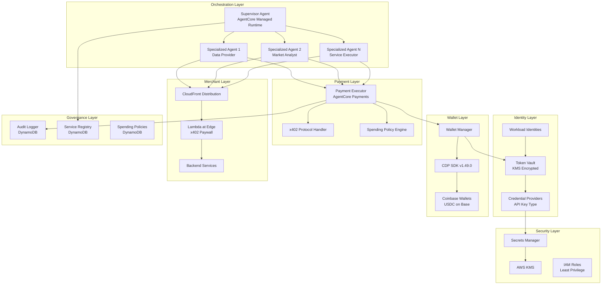
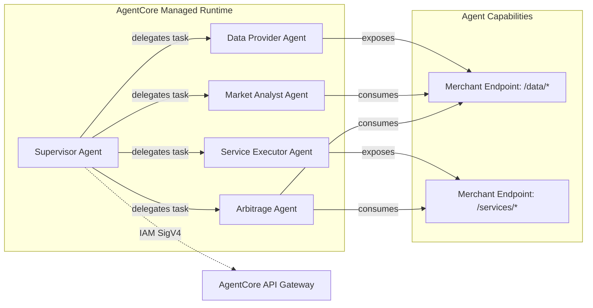
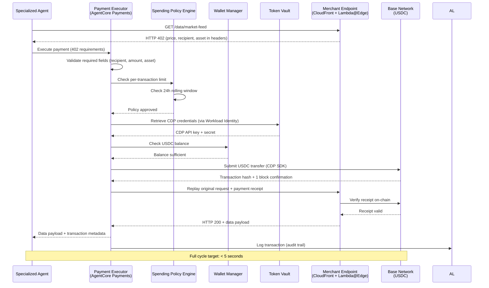
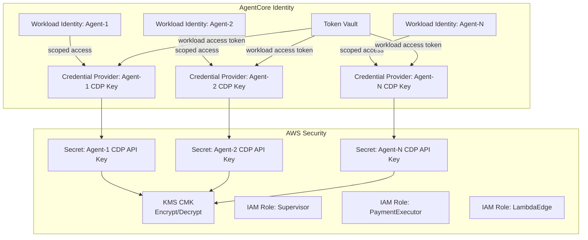

# Design Document: Multi-Agent Trading System

## Overview

This document describes the technical design for a multi-agent trading system where AI agents autonomously trade data and services using x402 micropayments. The system leverages Amazon Bedrock AgentCore for multi-agent orchestration (supervisor pattern), AgentCore Payments for managed x402 payment execution, AgentCore Identity for per-agent credential management, and the Coinbase CDP SDK for wallet provisioning and USDC transactions on the Base network.

The architecture follows a layered approach:
1. **Orchestration Layer** — Supervisor agent coordinates specialized agents via AgentCore multi-agent collaboration
2. **Payment Layer** — AgentCore Payments handles the x402 payment lifecycle (402 → pay → replay)
3. **Identity Layer** — AgentCore Identity provides per-agent Workload Identities, Token Vault, and Credential Providers
4. **Wallet Layer** — CDP SDK manages Coinbase wallets for USDC income/spending
5. **Merchant Layer** — CloudFront + Lambda@Edge exposes x402-paywalled endpoints
6. **Governance Layer** — Spending policies, audit logging, and service discovery

All infrastructure is defined as AWS CDK constructs in TypeScript, deployed as a single CDK application.

## Architecture

### High-Level System Architecture



### CDK Stack Structure

```mermaid
graph TB
    subgraph "CDK Application"
        APP[TradingSystemApp]
        APP --> FS[FoundationStack]
        APP --> IS[IdentityStack]
        APP --> AS[AgentStack]
        APP --> PS[PaymentStack]
        APP --> MS[MerchantStack]
        APP --> GS[GovernanceStack]
    end

    subgraph "FoundationStack"
        KMS_C[KMS Key Construct]
        SM_C[Secrets Manager Construct]
        VPC_C[VPC Construct]
    end

    subgraph "IdentityStack"
        WI_C[WorkloadIdentity Construct]
        TV_C[TokenVault Construct]
        CP_C[CredentialProvider Construct]
    end

    subgraph "AgentStack"
        SUP_C[SupervisorAgent Construct]
        SPEC_C[SpecializedAgent Construct]
        SESS_C[SessionMemory Construct]
    end

    subgraph "PaymentStack"
        PE_C[PaymentExecutor Construct]
        SPE_C[SpendingPolicy Construct]
        WAL_C[WalletManager Construct]
    end

    subgraph "MerchantStack"
        CF_C[CloudFront Construct]
        LE_C[LambdaEdge Construct]
        PRICE_C[PricingConfig Construct]
    end

    subgraph "GovernanceStack"
        AL_C[AuditLogger Construct]
        SR_C[ServiceRegistry Construct]
        ALERT_C[AlertingConstruct]
    end

    FS --> IS
    IS --> AS
    IS --> PS
    PS --> MS
    AS --> GS
    PS --> GS
    MS --> GS
```



### Agent Topology



**Supervisor Agent** operates in "Supervisor" mode (synthesizes responses from collaborators). It:
- Receives trading tasks via the AgentCore API Gateway (authenticated with IAM SigV4)
- Matches tasks to specialized agents by declared task-type
- Delegates with a 30-second timeout, retries once on timeout
- Selects next action: delegate further, return result, or initiate error handling

**Specialized Agents** (1–10 concurrent) each have:
- A registered task-type for routing
- A dedicated Coinbase wallet (USDC on Base)
- A Workload Identity scoped to their own Credential Provider
- A Spending Policy governing payment limits
- Optional Merchant Endpoint(s) for selling data/services

### x402 Payment Flow



## Components and Interfaces

### 1. Supervisor Agent

**Responsibility:** Orchestrate specialized agents, route tasks, handle timeouts and errors.

```typescript
interface SupervisorAgentConfig {
  agentName: string;
  modelId: string; // e.g., "anthropic.claude-sonnet-4-20250514"
  collaboratorAgents: CollaboratorAgentConfig[];
  sessionMemoryTtlHours: number; // minimum 24
  apiGatewayAuth: 'IAM_SIGV4';
}

interface CollaboratorAgentConfig {
  agentId: string;
  agentAliasId: string;
  taskTypes: string[];
  description: string;
  timeoutSeconds: number; // default 30
  maxRetries: number; // default 1
}

interface TaskDelegation {
  taskId: string;
  taskType: string;
  payload: Record<string, unknown>;
  sourceAgentId: string;
  delegatedAt: string; // ISO 8601
}

interface DelegationResult {
  taskId: string;
  status: 'completed' | 'failed' | 'timeout';
  result?: Record<string, unknown>;
  error?: {
    agentId: string;
    taskType: string;
    reason: string;
  };
}
```

### 2. Wallet Manager

**Responsibility:** Provision wallets, query balances, manage CDP SDK interactions via AgentCore Identity.

```typescript
interface WalletManagerConfig {
  cdpApiKeySecretArn: string;
  kmsKeyArn: string;
  network: 'base'; // USDC on Base
  provisioningTimeoutMs: number; // 30000
}

interface AgentWallet {
  agentId: string;
  walletId: string;
  address: string; // EVM address on Base
  network: 'base';
  asset: 'USDC';
  createdAt: string; // ISO 8601
  workloadIdentityArn: string;
  credentialProviderArn: string;
}

interface WalletBalance {
  agentId: string;
  walletId: string;
  balance: string; // USDC amount, 2 decimal places for display, 6 for internal
  lastUpdated: string; // ISO 8601
}

interface WalletManager {
  provisionWallet(agentId: string): Promise<AgentWallet>;
  getBalance(agentId: string): Promise<WalletBalance>;
  creditWallet(agentId: string, amount: string, txHash: string): Promise<void>;
  getCredentials(agentId: string): Promise<CdpCredentials>; // via Token Vault only
}
```

### 3. Payment Executor

**Responsibility:** Handle the full x402 payment cycle — extract requirements, enforce policies, execute on-chain, replay.

```typescript
interface PaymentRequirements {
  recipientAddress: string;
  amount: string; // USDC amount
  asset: 'USDC';
  network: 'base';
  paymentId: string;
  expiresAt?: string; // ISO 8601
}

interface PaymentRequest {
  requestingAgentId: string;
  merchantEndpointUrl: string;
  paymentRequirements: PaymentRequirements;
  originalRequest: {
    method: string;
    url: string;
    headers: Record<string, string>;
    body?: string;
  };
}

interface PaymentResult {
  status: 'settled' | 'rejected' | 'failed';
  transactionHash?: string;
  replayResponse?: {
    statusCode: number;
    headers: Record<string, string>;
    body: string;
  };
  error?: {
    code: 'INSUFFICIENT_BALANCE' | 'EXCEEDS_TRANSACTION_LIMIT' | 'EXCEEDS_CUMULATIVE_LIMIT' |
          'NO_SPENDING_POLICY' | 'MISSING_FIELDS' | 'ON_CHAIN_FAILURE' | 'REPLAY_FAILED';
    message: string;
    transactionHash?: string;
    originalRequest?: PaymentRequest['originalRequest'];
  };
}

interface PaymentExecutor {
  executePayment(request: PaymentRequest): Promise<PaymentResult>;
  extractRequirements(response: HttpResponse): PaymentRequirements | null;
  validateRequirements(requirements: PaymentRequirements): ValidationResult;
}
```

### 4. Spending Policy Engine

**Responsibility:** Enforce per-transaction and cumulative spending limits.

```typescript
interface SpendingPolicy {
  agentId: string;
  perTransactionLimitUsdc: string; // 0.01 to 999,999,999.99
  cumulativeLimitUsdc: string; // 24-hour rolling window
  updatedAt: string; // ISO 8601
}

interface PolicyEvaluation {
  agentId: string;
  paymentAmount: string;
  perTransactionLimit: string;
  cumulativeSpent24h: string;
  cumulativeLimit: string;
  approved: boolean;
  rejectionReason?: 'PER_TRANSACTION_EXCEEDED' | 'CUMULATIVE_EXCEEDED' | 'NO_POLICY';
}

interface SpendingPolicyEngine {
  evaluate(agentId: string, amount: string): Promise<PolicyEvaluation>;
  updatePolicy(policy: SpendingPolicy): Promise<void>;
  getCumulativeSpend(agentId: string, windowHours: number): Promise<string>;
}
```

### 5. Audit Logger

**Responsibility:** Record all payment events with correlation IDs, support querying.

```typescript
interface AuditRecord {
  correlationId: string; // unique per payment lifecycle
  sourceAgentId: string;
  destinationAgentId: string;
  amountUsdc: string; // 6 decimal places
  transactionHash: string;
  timestamp: string; // ISO 8601 UTC
  status: 'initiated' | 'settled' | 'failed' | 'pending_review';
  policyEvaluation: PolicyEvaluation;
  eventType: 'payment_initiated' | 'payment_settled' | 'payment_failed' |
             'income_credited' | 'reconciliation_failed' | 'duplicate_detected';
}

interface AuditQuery {
  startTime: string; // ISO 8601
  endTime: string; // ISO 8601
  agentId?: string;
  limit?: number; // max 10,000
}

interface AuditLogger {
  record(event: AuditRecord): Promise<void>;
  query(params: AuditQuery): Promise<AuditRecord[]>;
  flagForReview(correlationId: string, reason: string): Promise<void>;
}
```

### 6. Merchant Endpoint (Lambda@Edge)

**Responsibility:** Serve x402 paywalls, verify payment receipts, serve content.

```typescript
interface MerchantEndpointConfig {
  endpointPath: string;
  priceUsdc: string; // 0.01 to 10,000
  recipientAgentId: string;
  recipientWalletAddress: string;
  description: string; // max 500 chars
  capabilityTags: string[]; // at least one
}

interface PaymentReceipt {
  transactionHash: string;
  amount: string;
  recipientAddress: string;
  network: 'base';
  blockNumber: number;
  timestamp: string;
}

interface MerchantEndpoint {
  handleRequest(request: CloudFrontRequest): Promise<CloudFrontResponse>;
  verifyReceipt(receipt: PaymentReceipt): Promise<ReceiptVerification>;
  generatePaymentRequirements(path: string): PaymentRequirements;
}

interface ReceiptVerification {
  valid: boolean;
  reason?: 'INVALID_AMOUNT' | 'WRONG_RECIPIENT' | 'EXPIRED' | 'ALREADY_REDEEMED' | 'VERIFICATION_TIMEOUT';
}
```

### 7. Service Registry

**Responsibility:** Maintain discoverable catalog of merchant endpoints.

```typescript
interface ServiceRegistryEntry {
  endpointUrl: string;
  agentId: string;
  description: string; // max 500 characters
  priceUsdc: string; // 0.01 to 999,999.99
  capabilityTags: string[]; // at least one
  registeredAt: string; // ISO 8601
  status: 'active' | 'decommissioned';
}

interface ServiceRegistryQuery {
  capabilityTags: string[]; // match any
  limit?: number; // max 100
}

interface ServiceRegistry {
  register(entry: ServiceRegistryEntry): Promise<void>;
  decommission(endpointUrl: string): Promise<void>;
  query(params: ServiceRegistryQuery): Promise<ServiceRegistryEntry[]>;
}
```

### 8. Supply Chain Guard

**Responsibility:** Pin axios to 1.13.6, block compromised versions.

```typescript
// package.json overrides configuration
interface SupplyChainGuardConfig {
  pinnedVersion: '1.13.6';
  blockedVersions: ['1.14.1', '0.30.4'];
}
```

## Data Models

### DynamoDB Table Designs

#### Spending Policies Table

| Attribute | Type | Key | Description |
|-----------|------|-----|-------------|
| agentId | String | PK | Agent identifier |
| perTransactionLimitUsdc | String | — | Max per-transaction (0.01–999,999,999.99) |
| cumulativeLimitUsdc | String | — | Max 24h rolling window |
| updatedAt | String | — | ISO 8601 timestamp |

#### Audit Trail Table

| Attribute | Type | Key | Description |
|-----------|------|-----|-------------|
| correlationId | String | PK | Unique event identifier |
| timestamp | String | SK | ISO 8601 UTC |
| sourceAgentId | String | GSI1-PK | Source agent |
| destinationAgentId | String | — | Destination agent |
| amountUsdc | String | — | Amount (6 decimals) |
| transactionHash | String | GSI2-PK | On-chain tx hash |
| status | String | — | Event status |
| policyEvaluation | Map | — | Policy check result |
| eventType | String | — | Event classification |
| ttl | Number | — | 90-day expiry epoch |

**GSI1:** `sourceAgentId` (PK) + `timestamp` (SK) — for agent-filtered time-range queries
**GSI2:** `transactionHash` (PK) — for duplicate detection and reconciliation

#### Service Registry Table

| Attribute | Type | Key | Description |
|-----------|------|-----|-------------|
| endpointUrl | String | PK | Unique endpoint URL |
| agentId | String | GSI1-PK | Owning agent |
| description | String | — | Max 500 chars |
| priceUsdc | String | — | Price (0.01–999,999.99) |
| capabilityTags | StringSet | — | Service capabilities |
| registeredAt | String | — | ISO 8601 |
| status | String | — | active/decommissioned |

**GSI1:** `agentId` (PK) — for agent-specific lookups

#### Agent Wallets Table

| Attribute | Type | Key | Description |
|-----------|------|-----|-------------|
| agentId | String | PK | Agent identifier |
| walletId | String | — | CDP wallet ID |
| address | String | GSI1-PK | EVM address on Base |
| network | String | — | Always "base" |
| createdAt | String | — | ISO 8601 |
| workloadIdentityArn | String | — | AgentCore Identity ARN |
| credentialProviderArn | String | — | Credential Provider ARN |

**GSI1:** `address` (PK) — for address-based lookups (income crediting)

#### Payment Transactions Table (Rolling Window)

| Attribute | Type | Key | Description |
|-----------|------|-----|-------------|
| agentId | String | PK | Spending agent |
| timestamp | String | SK | ISO 8601 |
| amountUsdc | String | — | Payment amount |
| transactionHash | String | — | On-chain tx hash |
| status | String | — | settled/failed |
| ttl | Number | — | 48-hour expiry epoch |

Used by the Spending Policy Engine to compute 24-hour rolling cumulative spend.

#### Redeemed Receipts Table

| Attribute | Type | Key | Description |
|-----------|------|-----|-------------|
| transactionHash | String | PK | Receipt tx hash |
| redeemedAt | String | — | ISO 8601 |
| endpointPath | String | — | Which endpoint redeemed it |
| ttl | Number | — | 7-day expiry epoch |

Used by Merchant Endpoints to prevent double-redemption of payment receipts.

### Security Architecture



**Key Security Principles:**
1. **No plaintext keys in code** — All CDP private key material stored exclusively in Secrets Manager, accessed only via AgentCore Identity Token Vault
2. **Per-agent isolation** — Each agent's Workload Identity can only access its own Credential Provider (IAM policy scoping)
3. **KMS encryption** — All secrets encrypted at rest with a dedicated CMK
4. **Least privilege IAM** — No wildcard actions; resource ARNs scoped to specific resources
5. **SigV4 authentication** — All API requests to AgentCore authenticated via IAM SigV4
6. **Supply chain protection** — axios pinned to 1.13.6 via npm overrides, blocking known compromised versions


## Correctness Properties

*A property is a characteristic or behavior that should hold true across all valid executions of a system — essentially, a formal statement about what the system should do. Properties serve as the bridge between human-readable specifications and machine-verifiable correctness guarantees.*

### Property 1: Task Routing Correctness

*For any* set of registered specialized agents with declared task-types and *for any* incoming task with a declared type, the supervisor SHALL route the task to the agent whose task-type matches the declared type if one exists, OR reject the task with an error specifying the unrecognized type if no match exists.

**Validates: Requirements 1.2, 1.7**

### Property 2: Credential Retrieval Path Exclusivity

*For any* specialized agent requesting its CDP credentials at runtime, the retrieval path SHALL go exclusively through the AgentCore Identity Token Vault API and SHALL never invoke Secrets Manager directly.

**Validates: Requirements 2.4**

### Property 3: Balance Display Precision

*For any* USDC balance value returned by the Wallet Manager query interface, the formatted string SHALL contain exactly 2 decimal places.

**Validates: Requirements 2.6**

### Property 4: Non-Existent Wallet Error

*For any* agent identifier that does not have a provisioned wallet in the system, a balance query SHALL return an error indicating no wallet exists for that agent.

**Validates: Requirements 2.8**

### Property 5: Payment Requirements Extraction

*For any* HTTP 402 response, the Payment Executor SHALL correctly extract all payment requirement fields (recipient address, amount, asset type) when present, OR reject with an error identifying the specific missing fields when any required field is absent.

**Validates: Requirements 3.1, 3.2**

### Property 6: Payment Eligibility Validation

*For any* payment request with amount A and agent wallet balance B, the Payment Executor SHALL approve the payment if and only if B >= A AND A <= 10 USDC. When rejected, the error SHALL correctly identify whether the cause is insufficient balance or exceeding the 10 USDC cap.

**Validates: Requirements 3.3, 3.4**

### Property 7: Replay Failure Error Completeness

*For any* replay failure occurring after a successful on-chain payment, the error response SHALL contain the payment transaction hash, the replay failure reason, and the complete original request details.

**Validates: Requirements 3.6**

### Property 8: Income Precision Preservation

*For any* valid USDC payment amount credited to an agent's wallet, the credited amount SHALL preserve exactly 6 decimal places of precision.

**Validates: Requirements 4.1**

### Property 9: Duplicate Payment Rejection

*For any* on-chain transaction hash that has already been processed for a wallet credit, a subsequent credit attempt with the same transaction hash SHALL be rejected and the duplicate attempt SHALL be recorded in the audit log.

**Validates: Requirements 4.6**

### Property 10: Spending Policy Evaluation

*For any* payment amount A, per-transaction limit L, cumulative spend in the preceding 24 hours S, and cumulative limit C, the spending policy engine SHALL approve the payment if and only if A <= L AND (S + A) <= C. When rejected, the error SHALL correctly identify whether the per-transaction limit or cumulative limit was exceeded.

**Validates: Requirements 5.3, 5.4, 5.5**

### Property 11: No-Policy Rejection

*For any* specialized agent that does not have a spending policy defined, all payment requests SHALL be rejected with an error indicating no spending policy is configured.

**Validates: Requirements 5.7**

### Property 12: Spending Policy Range Validation

*For any* per-transaction limit value, the spending policy SHALL accept values in the range [0.01, 999,999,999.99] USDC and reject values outside this range.

**Validates: Requirements 5.1**

### Property 13: Audit Record Completeness

*For any* transaction event recorded by the Audit Logger, the record SHALL contain all required fields: source agent identifier, destination agent identifier, amount in USDC (6 decimal places), transaction hash, timestamp in ISO 8601 UTC format, payment status, and policy evaluation result.

**Validates: Requirements 4.3, 6.2**

### Property 14: Correlation ID Uniqueness

*For any* set of payment events recorded by the Audit Logger, every event SHALL have a unique correlation identifier — no two events SHALL share the same correlation ID.

**Validates: Requirements 6.1**

### Property 15: Audit Query Ordering and Limits

*For any* audit query with a time range and optional agent filter, the returned records SHALL be ordered by timestamp in descending order and the result set SHALL contain at most 10,000 records.

**Validates: Requirements 6.4**

### Property 16: Merchant 402 Response Correctness

*For any* request arriving at a Merchant Endpoint without a valid payment receipt, the response SHALL be HTTP 402 and SHALL include payment requirement headers specifying the price in USDC, the accepted network (Base), and the recipient payment address.

**Validates: Requirements 7.2**

### Property 17: Receipt Verification Correctness

*For any* x402 payment receipt presented to a Merchant Endpoint, the verification SHALL classify the receipt as valid (correct amount, correct recipient, not expired, not previously redeemed) and serve data, OR return HTTP 402 with the specific validation failure reason (invalid amount, wrong recipient, expired, or already redeemed).

**Validates: Requirements 7.3, 7.4, 7.5**

### Property 18: Pricing Configuration Validation

*For any* endpoint pricing configuration, the Merchant Endpoint SHALL accept prices in the range [0.01, 10,000] USDC and reject prices outside this range.

**Validates: Requirements 7.7**

### Property 19: IAM Least-Privilege Compliance

*For any* IAM policy statement in the synthesized CloudFormation template, no statement SHALL use wildcard ("*") actions and all Resource values SHALL be scoped to specific resource ARNs.

**Validates: Requirements 9.4**

### Property 20: Service Registry Entry Validation

*For any* service registry entry, the entry SHALL be accepted if and only if it has a valid endpoint URL, a description of at most 500 characters, a price in the range [0.01, 999,999.99] USDC, and at least one capability tag.

**Validates: Requirements 10.1**

### Property 21: Service Registry Tag-Based Query

*For any* set of registry entries and *for any* query with one or more capability tags, the returned results SHALL contain exactly those entries that have at least one matching tag, limited to a maximum of 100 results.

**Validates: Requirements 10.2**

## Error Handling

### Error Categories and Strategies

| Category | Error Type | Strategy | Recovery |
|----------|-----------|----------|----------|
| **Orchestration** | Agent timeout | Retry once (30s), then fail with error | Return error to caller with agent/task info |
| **Orchestration** | No matching agent | Immediate rejection | Return unrecognized task type error |
| **Wallet** | Provisioning failure | Return error within 5s | Log failure, return agent ID + reason |
| **Wallet** | Balance query for unknown agent | Immediate error | Return "no wallet exists" message |
| **Payment** | Missing payment fields | Immediate rejection | Return missing field names |
| **Payment** | Insufficient balance | Immediate rejection, no on-chain tx | Return balance/amount mismatch |
| **Payment** | Exceeds 10 USDC cap | Immediate rejection, no on-chain tx | Return cap exceeded error |
| **Payment** | Policy violation (per-tx) | Immediate rejection | Return per-transaction limit error |
| **Payment** | Policy violation (cumulative) | Immediate rejection | Return cumulative limit error |
| **Payment** | No spending policy | Immediate rejection | Return no-policy error |
| **Payment** | On-chain failure | Return error with tx hash | Agent can retry or escalate |
| **Payment** | Replay failure after payment | Return error with tx hash + details | Agent retries with receipt |
| **Income** | Credit failure | Retry 3x exponential backoff | Flag for manual review |
| **Income** | Duplicate payment | Reject duplicate, log attempt | No action needed |
| **Income** | Reconciliation timeout | Flag for manual review | Operator investigates |
| **Audit** | Persistence failure | Retry 3x (1s, 2s, 4s) | Critical alert + in-memory preservation |
| **Merchant** | Invalid receipt | Return 402 with reason | Agent can re-pay |
| **Merchant** | Already-redeemed receipt | Return 402 "already used" | Agent must make new payment |
| **Merchant** | Verification unavailable | Return 503, don't consume receipt | Agent retries later |
| **Registry** | Service unavailable | Return error with 5s retry guidance | Agent retries after delay |

### Error Response Format

All error responses follow a consistent structure:

```typescript
interface TradingSystemError {
  code: string; // Machine-readable error code
  message: string; // Human-readable description
  details: {
    agentId?: string;
    taskType?: string;
    transactionHash?: string;
    amount?: string;
    limit?: string;
    missingFields?: string[];
    originalRequest?: object;
  };
  timestamp: string; // ISO 8601 UTC
  correlationId: string;
}
```

### Retry Policies

| Component | Max Retries | Backoff Strategy | Initial Delay |
|-----------|-------------|-----------------|---------------|
| Supervisor → Agent | 1 | None (immediate) | 0s |
| Wallet credit | 3 | Exponential | 1s |
| Audit persistence | 3 | Exponential (doubling) | 1s |
| Payment on-chain | 0 (no auto-retry) | N/A | N/A |

## Testing Strategy

### Property-Based Testing

This system is well-suited for property-based testing due to its many pure validation functions, policy evaluation logic, and data transformation operations.

**Library:** [fast-check](https://github.com/dubzzz/fast-check) (TypeScript PBT library)

**Configuration:**
- Minimum 100 iterations per property test
- Each property test tagged with: `Feature: multi-agent-trading-system, Property {N}: {title}`

**Properties to implement as PBT:**
- Properties 1, 3–6, 8–21 (pure logic, validation, formatting)
- Property 2 (credential path) uses mock interception
- Property 19 (IAM compliance) operates on synthesized CloudFormation JSON

### Unit Tests (Example-Based)

Focus areas:
- Timeout and retry behavior (Requirements 1.4, 1.5)
- Wallet provisioning failure handling (Requirement 2.7)
- On-chain payment failure (Requirement 3.8)
- Reconciliation timeout flagging (Requirement 4.4)
- Credit retry with exponential backoff (Requirement 4.5)
- Audit persistence retry and alert (Requirements 6.5, 6.6)
- Verification unavailability (Requirement 7.6)
- Supply chain guard detection (Requirement 8.4)
- Registry unavailability (Requirement 10.6)

### Integration Tests

Focus areas:
- CDP SDK wallet provisioning end-to-end (Requirement 2.1)
- AgentCore Identity credential flow (Requirements 2.2, 2.3)
- Full x402 payment cycle timing (Requirement 3.7)
- On-chain reconciliation (Requirement 4.2)
- Policy update propagation (Requirement 5.6)
- Merchant endpoint deployment and registration (Requirements 10.3, 10.4)
- CDK synthesis validation (Requirement 9.3)

### Smoke Tests

- Agent count limits (Requirement 1.1)
- SigV4 authentication (Requirement 1.6)
- npm overrides configuration (Requirements 8.1, 8.2, 8.3)
- CDK resource types present (Requirements 9.1, 9.2)
- Session memory TTL (Requirement 9.5)
- Rollback configuration (Requirement 9.6)
- Audit TTL configuration (Requirement 6.3)

### Test Environment

- **Mocks:** CDP SDK, AgentCore APIs, Base network RPC for unit/property tests
- **Local:** DynamoDB Local for data model tests
- **Integration:** AWS test account with isolated AgentCore deployment
- **CI:** All property and unit tests run on every PR; integration tests on merge to main
