# Implementation Plan: Multi-Agent Trading System

## Overview

This plan implements a multi-agent trading system using Amazon Bedrock AgentCore, Coinbase CDP SDK, and x402 micropayments. Tasks follow the CDK stack dependency order: Foundation → Identity → Agent → Payment → Merchant → Governance, building from infrastructure to application logic to testing.

## Tasks

- [x] 1. Set up project structure and dependency security
  - [x] 1.1 Initialize CDK application and project structure
    - Create CDK app entry point (`bin/trading-system.ts`) and stack files under `lib/`
    - Configure `tsconfig.json`, `jest.config.ts`, and fast-check test setup
    - Define shared TypeScript interfaces from the design (all interfaces in `lib/types/`)
    - _Requirements: 9.1, 9.2_

  - [x] 1.2 Configure Supply Chain Guard (npm overrides)
    - Add npm overrides in `package.json` to pin axios to 1.13.6
    - Add `preinstall` script that verifies no compromised axios versions (1.14.1, 0.30.4) resolve in the dependency tree
    - Fail installation with security alert if compromised version detected
    - _Requirements: 8.1, 8.2, 8.3, 8.4_

  - [x] 1.3 Write property tests for Supply Chain Guard
    - **Property 19: IAM Least-Privilege Compliance** — verify no wildcard actions in synthesized templates (deferred to stack synthesis)
    - Verify npm overrides block compromised versions
    - _Requirements: 8.1, 8.2_

- [x] 2. Implement Foundation Stack
  - [x] 2.1 Create FoundationStack with KMS, Secrets Manager, and VPC constructs
    - Define KMS CMK for encrypting all secrets (CDP keys, tokens)
    - Create Secrets Manager resource patterns for per-agent CDP API keys
    - Configure VPC if needed for Lambda networking
    - Export KMS key ARN and VPC references for dependent stacks
    - _Requirements: 9.1, 9.2, 9.4_

  - [x] 2.2 Write unit tests for FoundationStack synthesis
    - Verify CloudFormation template synthesizes without errors
    - Verify no wildcard IAM actions in generated policies
    - _Requirements: 9.3, 9.4_

- [x] 3. Implement Identity Stack
  - [x] 3.1 Create IdentityStack with AgentCore Identity constructs
    - Define Workload Identity resources (one per agent)
    - Define Token Vault configuration with KMS encryption
    - Define Credential Provider resources (API Key type) referencing Secrets Manager ARNs
    - Scope each Workload Identity to access only its own Credential Provider via IAM policy
    - _Requirements: 2.2, 2.3, 2.4, 2.9, 9.4_

  - [x] 3.2 Write property test for Credential Retrieval Path Exclusivity
    - **Property 2: Credential Retrieval Path Exclusivity**
    - Verify credential retrieval goes exclusively through Token Vault API, never directly to Secrets Manager
    - **Validates: Requirements 2.4**

- [x] 4. Implement Agent Stack
  - [x] 4.1 Create AgentStack with Supervisor and Specialized Agent constructs
    - Define Supervisor Agent in AgentCore managed runtime with supervisor mode
    - Configure collaborator agent associations with task-type routing
    - Set 30-second timeout and 1 retry for delegations
    - Configure IAM SigV4 authentication on AgentCore API gateway
    - Configure session memory with 24-hour TTL
    - _Requirements: 1.1, 1.2, 1.3, 1.4, 1.5, 1.6, 9.5_

  - [x] 4.2 Implement task routing logic for Supervisor Agent
    - Implement task-type matching: match incoming task declared type to agent registered task-types
    - Implement delegation with timeout (30s) and single retry
    - Implement next-action selection: delegate further, return result, or error handling
    - Implement rejection for unrecognized task types
    - _Requirements: 1.2, 1.3, 1.4, 1.5, 1.7_

  - [x] 4.3 Write property test for Task Routing Correctness
    - **Property 1: Task Routing Correctness**
    - For any set of agents with task-types and any incoming task, verify correct routing or rejection
    - **Validates: Requirements 1.2, 1.7**

  - [x] 4.4 Write unit tests for Supervisor Agent timeout and retry behavior
    - Test 30-second timeout triggers retry
    - Test failure after retry returns error with agent/task info
    - _Requirements: 1.4, 1.5_

- [x] 5. Checkpoint - Foundation and orchestration layers
  - Ensure all tests pass, ask the user if questions arise.

- [x] 6. Implement Wallet Manager component
  - [x] 6.1 Implement WalletManager with CDP SDK integration
    - Implement `provisionWallet`: create Coinbase wallet via CDP SDK v1.49.0, store API key in Secrets Manager, create Credential Provider and Workload Identity
    - Implement `getBalance`: query wallet USDC balance, format to 2 decimal places for display
    - Implement `getCredentials`: retrieve CDP credentials exclusively via Token Vault
    - Implement `creditWallet`: credit incoming USDC with 6 decimal precision
    - Handle provisioning timeout (30s) and failure error responses
    - Handle balance query for non-existent agent (error response)
    - _Requirements: 2.1, 2.2, 2.3, 2.4, 2.5, 2.6, 2.7, 2.8, 2.9_

  - [x] 6.2 Write property tests for Wallet Manager
    - **Property 3: Balance Display Precision** — verify all balance strings have exactly 2 decimal places
    - **Property 4: Non-Existent Wallet Error** — verify error for unknown agent IDs
    - **Property 8: Income Precision Preservation** — verify credited amounts preserve 6 decimal places
    - **Validates: Requirements 2.6, 2.8, 4.1**

- [x] 7. Implement Payment Stack
  - [x] 7.1 Create PaymentStack CDK constructs
    - Define Payment Executor Lambda function with IAM roles
    - Define Spending Policy DynamoDB table (agentId PK)
    - Define Payment Transactions DynamoDB table (agentId PK, timestamp SK, 48h TTL)
    - Define Agent Wallets DynamoDB table (agentId PK, address GSI)
    - Wire Token Vault access for credential retrieval
    - _Requirements: 9.1, 9.2, 9.4_

  - [x] 7.2 Implement Spending Policy Engine
    - Implement `evaluate`: check per-transaction limit (A <= L) and cumulative 24h window (S + A <= C)
    - Implement `updatePolicy`: store/update policy, apply within 10 seconds
    - Implement `getCumulativeSpend`: query Payment Transactions table for 24h rolling window
    - Validate policy range [0.01, 999,999,999.99] USDC
    - Reject payments when no policy is defined for agent
    - _Requirements: 5.1, 5.2, 5.3, 5.4, 5.5, 5.6, 5.7_

  - [x] 7.3 Write property tests for Spending Policy Engine
    - **Property 10: Spending Policy Evaluation** — verify approval iff A <= L AND (S + A) <= C with correct rejection reasons
    - **Property 11: No-Policy Rejection** — verify all payments rejected when no policy exists
    - **Property 12: Spending Policy Range Validation** — verify acceptance of [0.01, 999,999,999.99] and rejection outside
    - **Validates: Requirements 5.1, 5.3, 5.4, 5.5, 5.7**

  - [x] 7.4 Implement Payment Executor
    - Implement `extractRequirements`: parse HTTP 402 response headers for recipient, amount, asset
    - Implement `validateRequirements`: check all required fields present
    - Implement `executePayment`: full cycle — validate fields → check policy → check balance → check 10 USDC cap → submit on-chain → replay with receipt
    - Handle all error cases: missing fields, insufficient balance, exceeds cap, policy violation, on-chain failure, replay failure
    - Include transaction hash and original request in replay failure errors
    - _Requirements: 3.1, 3.2, 3.3, 3.4, 3.5, 3.6, 3.7, 3.8_

  - [x] 7.5 Write property tests for Payment Executor
    - **Property 5: Payment Requirements Extraction** — verify correct extraction or error for missing fields
    - **Property 6: Payment Eligibility Validation** — verify approval iff balance >= amount AND amount <= 10 USDC
    - **Property 7: Replay Failure Error Completeness** — verify error contains tx hash, reason, and original request
    - **Validates: Requirements 3.1, 3.2, 3.3, 3.4, 3.6**

  - [x] 7.6 Write unit tests for Payment Executor edge cases
    - Test on-chain payment failure returns error with tx hash
    - Test full payment cycle timing constraint (< 5 seconds)
    - _Requirements: 3.7, 3.8_

- [x] 8. Checkpoint - Payment layer complete
  - Ensure all tests pass, ask the user if questions arise.

- [x] 9. Implement Merchant Stack
  - [x] 9.1 Create MerchantStack with CloudFront and Lambda@Edge constructs
    - Define CloudFront distribution for merchant endpoints
    - Define Lambda@Edge function for x402 paywall logic
    - Define Redeemed Receipts DynamoDB table (transactionHash PK, 7-day TTL)
    - Configure pricing per endpoint path (0.01–10,000 USDC)
    - _Requirements: 7.1, 7.7, 9.1, 9.2_

  - [x] 9.2 Implement Merchant Endpoint Lambda@Edge handler
    - Implement `handleRequest`: check for payment receipt → if absent, return 402 with payment requirements
    - Implement `generatePaymentRequirements`: return price, network (Base), recipient address in headers
    - Implement `verifyReceipt`: on-chain verification (correct amount, correct recipient, not expired, not redeemed)
    - Check Redeemed Receipts table for double-redemption prevention
    - Return 402 with specific failure reason for invalid receipts
    - Return 503 if on-chain verification unavailable or times out (30s)
    - _Requirements: 7.2, 7.3, 7.4, 7.5, 7.6_

  - [x] 9.3 Write property tests for Merchant Endpoint
    - **Property 16: Merchant 402 Response Correctness** — verify 402 response includes price, network, recipient address
    - **Property 17: Receipt Verification Correctness** — verify valid receipts serve data, invalid return 402 with reason
    - **Property 18: Pricing Configuration Validation** — verify acceptance of [0.01, 10,000] USDC range
    - **Validates: Requirements 7.2, 7.3, 7.4, 7.5, 7.7**

- [x] 10. Implement Governance Stack
  - [x] 10.1 Create GovernanceStack with Audit Logger and Service Registry constructs
    - Define Audit Trail DynamoDB table (correlationId PK, timestamp SK, GSI1 on sourceAgentId+timestamp, GSI2 on transactionHash, 90-day TTL)
    - Define Service Registry DynamoDB table (endpointUrl PK, GSI1 on agentId)
    - Define alerting construct for critical audit failures
    - _Requirements: 6.3, 9.1, 9.2_

  - [x] 10.2 Implement Audit Logger
    - Implement `record`: persist audit event with all required fields (source, destination, amount 6dp, tx hash, ISO 8601 timestamp, status, policy evaluation)
    - Implement `query`: time-range + optional agent filter, descending timestamp order, max 10,000 results, within 5 seconds
    - Implement `flagForReview`: mark unreconciled transactions as pending_review
    - Implement retry logic: 3 retries with exponential backoff (1s, 2s, 4s)
    - Implement critical alert emission on exhausted retries with in-memory preservation
    - Implement duplicate payment detection via GSI2 (transactionHash)
    - _Requirements: 4.3, 4.4, 4.5, 4.6, 6.1, 6.2, 6.3, 6.4, 6.5, 6.6_

  - [x] 10.3 Write property tests for Audit Logger
    - **Property 9: Duplicate Payment Rejection** — verify duplicate tx hash rejected and logged
    - **Property 13: Audit Record Completeness** — verify all required fields present in every record
    - **Property 14: Correlation ID Uniqueness** — verify no two events share a correlation ID
    - **Property 15: Audit Query Ordering and Limits** — verify descending order and max 10,000 results
    - **Validates: Requirements 4.6, 6.1, 6.2, 6.4**

  - [x] 10.4 Write unit tests for Audit Logger retry and alerting
    - Test 3 retries with exponential backoff (1s, 2s, 4s)
    - Test critical alert emission after exhausted retries
    - Test in-memory preservation of unpersisted records
    - _Requirements: 6.5, 6.6_

  - [x] 10.5 Implement Service Registry
    - Implement `register`: add endpoint with URL, description (max 500 chars), price, capability tags (at least one)
    - Implement `decommission`: mark endpoint as decommissioned within 30 seconds
    - Implement `query`: tag-based matching (any tag matches), max 100 results, within 5 seconds
    - Return empty result set with message when no services match
    - Return error with 5-second retry guidance when registry unavailable
    - _Requirements: 10.1, 10.2, 10.3, 10.4, 10.5, 10.6_

  - [x] 10.6 Write property tests for Service Registry
    - **Property 20: Service Registry Entry Validation** — verify acceptance with valid URL, description ≤500 chars, price [0.01, 999,999.99], at least one tag
    - **Property 21: Service Registry Tag-Based Query** — verify results contain exactly entries with at least one matching tag, max 100
    - **Validates: Requirements 10.1, 10.2**

- [x] 11. Checkpoint - All stacks implemented
  - Ensure all tests pass, ask the user if questions arise.

- [x] 12. Integration wiring and IAM validation
  - [x] 12.1 Wire all stacks together in CDK app entry point
    - Configure stack dependencies (Foundation → Identity → Agent/Payment → Merchant → Governance)
    - Pass cross-stack references (KMS key ARN, VPC, table ARNs, function ARNs)
    - Configure CDK rollback behavior for failed deployments
    - _Requirements: 9.2, 9.6_

  - [x] 12.2 Implement income reconciliation and wallet credit flow
    - Wire Payment Executor settlement events to Wallet Manager credit
    - Implement 60-second reconciliation window for on-chain confirmations
    - Implement retry (3x exponential backoff) for failed credits
    - Flag unreconciled transactions for manual review via Audit Logger
    - _Requirements: 4.1, 4.2, 4.4, 4.5_

  - [x] 12.3 Write property test for IAM Least-Privilege Compliance
    - **Property 19: IAM Least-Privilege Compliance**
    - Synthesize full CDK app and verify no IAM policy statement uses wildcard actions and all resources are scoped
    - **Validates: Requirements 9.4**

  - [x] 12.4 Write integration tests for end-to-end flows
    - Test full x402 payment cycle: 402 → pay → replay
    - Test wallet provisioning → credential retrieval via Token Vault
    - Test merchant endpoint registration → service discovery query
    - Test spending policy update propagation (< 10 seconds)
    - _Requirements: 2.1, 2.4, 3.7, 5.6, 10.3_

- [x] 13. Final checkpoint - All tests pass
  - Ensure all tests pass, ask the user if questions arise.

## Notes

- Tasks marked with `*` are optional and can be skipped for faster MVP
- Each task references specific requirements for traceability
- Checkpoints ensure incremental validation
- Property tests validate universal correctness properties from the design document using fast-check
- Unit tests validate specific examples and edge cases
- All code is TypeScript; CDK constructs and application logic share the same language
- axios is pinned to 1.13.6 via npm overrides to prevent supply chain attacks
- DynamoDB tables use TTL for automatic data lifecycle management (48h for payment transactions, 7d for receipts, 90d for audit)

## Task Dependency Graph

```mermaid
graph LR
    subgraph "Wave 0 — Project Setup"
        T1_1[1.1 Init CDK Project]
        T1_2[1.2 Supply Chain Guard]
    end

    subgraph "Wave 1 — Foundation"
        T1_3[1.3 Supply Chain Tests]
        T2_1[2.1 Foundation Stack]
    end

    subgraph "Wave 2 — Identity"
        T2_2[2.2 Foundation Tests]
        T3_1[3.1 Identity Stack]
    end

    subgraph "Wave 3 — Agents"
        T3_2[3.2 Credential Path Tests]
        T4_1[4.1 Agent Stack]
    end

    subgraph "Wave 4 — Agent Logic"
        T4_2[4.2 Task Routing]
        T4_3[4.3 Routing Tests]
        T4_4[4.4 Timeout Tests]
    end

    subgraph "Wave 5 — Wallet & Payment Infra"
        T6_1[6.1 Wallet Manager]
        T7_1[7.1 Payment Stack]
    end

    subgraph "Wave 6 — Policy Engine"
        T6_2[6.2 Wallet Tests]
        T7_2[7.2 Spending Policy]
    end

    subgraph "Wave 7 — Payment Executor"
        T7_3[7.3 Policy Tests]
        T7_4[7.4 Payment Executor]
    end

    subgraph "Wave 8 — Merchant Infra"
        T7_5[7.5 Payment Tests]
        T7_6[7.6 Payment Edge Cases]
        T9_1[9.1 Merchant Stack]
    end

    subgraph "Wave 9 — Merchant & Governance"
        T9_2[9.2 Merchant Handler]
        T10_1[10.1 Governance Stack]
    end

    subgraph "Wave 10 — Governance Logic"
        T9_3[9.3 Merchant Tests]
        T10_2[10.2 Audit Logger]
        T10_5[10.5 Service Registry]
    end

    subgraph "Wave 11 — Governance Tests"
        T10_3[10.3 Audit Tests]
        T10_4[10.4 Audit Retry Tests]
        T10_6[10.6 Registry Tests]
    end

    subgraph "Wave 12 — Integration"
        T12_1[12.1 Wire Stacks]
    end

    subgraph "Wave 13 — Reconciliation"
        T12_2[12.2 Income Reconciliation]
        T12_3[12.3 IAM Compliance Test]
    end

    subgraph "Wave 14 — E2E"
        T12_4[12.4 Integration Tests]
    end

    T1_1 & T1_2 --> T1_3 & T2_1
    T1_3 & T2_1 --> T2_2 & T3_1
    T2_2 & T3_1 --> T3_2 & T4_1
    T3_2 & T4_1 --> T4_2 & T4_3 & T4_4
    T4_2 & T4_3 & T4_4 --> T6_1 & T7_1
    T6_1 & T7_1 --> T6_2 & T7_2
    T6_2 & T7_2 --> T7_3 & T7_4
    T7_3 & T7_4 --> T7_5 & T7_6 & T9_1
    T7_5 & T7_6 & T9_1 --> T9_2 & T10_1
    T9_2 & T10_1 --> T9_3 & T10_2 & T10_5
    T9_3 & T10_2 & T10_5 --> T10_3 & T10_4 & T10_6
    T10_3 & T10_4 & T10_6 --> T12_1
    T12_1 --> T12_2 & T12_3
    T12_2 & T12_3 --> T12_4
```

